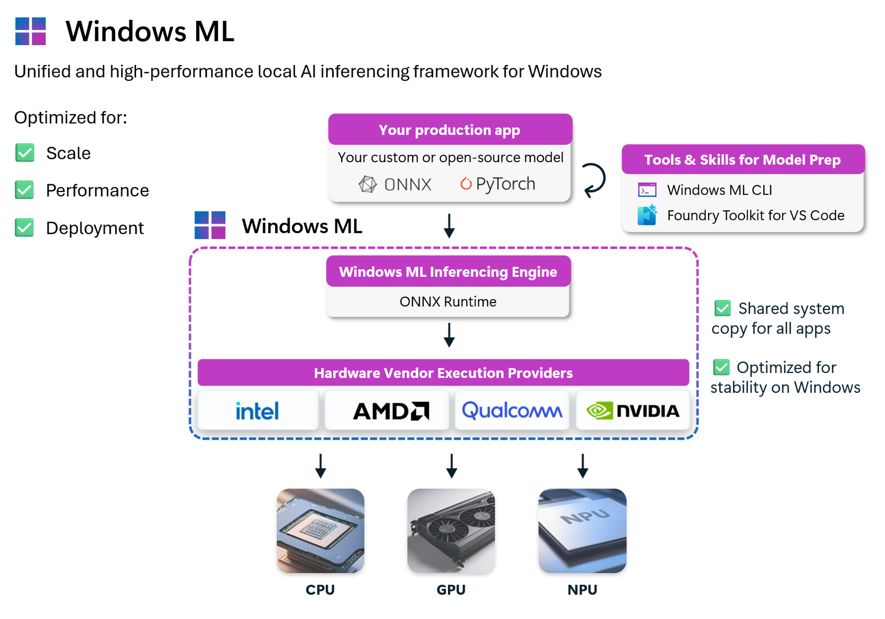

# Windows ML

[](https://blogs.windows.com/windowsdeveloper/2025/09/23/windows-ml-is-generally-available-empowering-developers-to-scale-local-ai-across-windows-devices/)
[](LICENSE)

[](https://www.nuget.org/packages/Microsoft.Windows.AI.MachineLearning)
[](https://www.nuget.org/packages/Microsoft.WindowsAppSDK.ML)
[](https://www.nuget.org/packages/Microsoft.ML.OnnxRuntimeGenAI.WinML)

Windows ML is the unified and high-performance local AI inferencing framework for Windows, powered by [ONNX Runtime](https://onnxruntime.ai/). With Windows ML, you can run AI models locally and accelerate inference on NPUs, GPUs, and CPUs through optional execution providers that Windows manages and keeps up to date. You can use models from PyTorch, TensorFlow/Keras, TFLite, scikit-learn, and convert them to ONNX to use them with Windows ML.

Windows ML is [generally available](https://blogs.windows.com/windowsdeveloper/2025/09/23/windows-ml-is-generally-available-empowering-developers-to-scale-local-ai-across-windows-devices/) and is available two ways: as part of the [Windows App SDK](https://learn.microsoft.com/en-us/windows/apps/windows-app-sdk/) (1.8.1+) via [`Microsoft.WindowsAppSDK.ML`](https://www.nuget.org/packages/Microsoft.WindowsAppSDK.ML), or as a **standalone** package — [`Microsoft.Windows.AI.MachineLearning`](https://www.nuget.org/packages/Microsoft.Windows.AI.MachineLearning) — with no Windows App SDK dependency.



## Why Windows ML

Windows ML is Microsoft's recommended local AI inferencing framework for Windows — the official, Windows-native way to run custom and open-source AI models on Windows PCs, with hardware-accelerated inference across **CPU**, **GPU**, and **NPU**. It's built and optimized for **Scale**, **Performance**, and **Deployment** across the Windows ecosystem.

- **Run AI on-device** — models run locally on the user's hardware, keeping data private, reducing latency, eliminating cloud costs, and working without an internet connection.
- **Use models you already have** — bring models from PyTorch, TensorFlow, scikit-learn, Hugging Face, and more, convert them to ONNX, and use them with Windows ML.
- **Scale across silicon** - Windows ML is powered by ONNX Runtime and offers broad hardware support, so you can scale your workloads across Windows PCs with any hardware configuration.
- **Hardware acceleration, facilitated by Windows** — Windows ML allows you to access NPUs, GPUs, and CPUs via execution providers that Windows installs and keeps up to date — no need to bundle them in your app.
- **One runtime, many apps** — optionally use Windows ML as a shared system component, so your app stays small and all apps on the device share the same up-to-date runtime, rather than every app bundling its own copy.
- **Windows-supported** — regardless of how you deploy, you get Windows-maintained, optimized runtime dependencies built for stability across updates.
- **Best-in-class performance** — Windows ML delivers performance on par with dedicated SDKs like TensorRT for RTX or Qualcomm's AI Engine Direct. See [Accelerate AI models](https://learn.microsoft.com/en-us/windows/ai/new-windows-ml/accelerate-ai-models) for hardware and model-specific guidance.

To learn about the benefits of using Windows ML compared to ONNX Runtime directly, see the [Windows ML docs](https://learn.microsoft.com/en-us/windows/ai/new-windows-ml/overview#why-use-windows-ml-instead-of-microsoft-ort).

## Companion tools

Windows ML works hand-in-hand with two Microsoft-built tools that handle the steps around inference:

- **[Foundry Toolkit for VS Code](https://code.visualstudio.com/docs/intelligentapps/overview)** — convert, quantize, optimize, and evaluate ONNX models inside VS Code before shipping.
- **[Windows ML CLI](https://aka.ms/winmlcli)** *(preview)* — a unified, agent-ready toolchain for model prep, optimization, and benchmarking, with agent skills for AI and agent-driven workflows.

Both ship from Microsoft and are designed to feed directly into Windows ML.

## Hello, Windows ML

The shortest possible Windows ML program in C#: discover and register execution providers, then run an ONNX model — and choose a policy to control which hardware runs it.

```csharp
using Microsoft.Windows.AI.MachineLearning;
using Microsoft.ML.OnnxRuntime;

// 1. Discover execution providers from the Windows ML EP catalog.
//    Windows installs and keeps these up to date — your app doesn't bundle them.
var catalog = ExecutionProviderCatalog.GetDefault();
foreach (var provider in catalog.FindAllProviders())
{
    await provider.EnsureReadyAsync();
    provider.TryRegister();
}

// 2. Create an ONNX Runtime environment.
var envOptions = new EnvironmentCreationOptions { logId = "HelloWindowsML" };
using var ortEnv = OrtEnv.CreateInstanceWithOptions(ref envOptions);

// 3. Pick an execution provider policy.
using var sessionOptions = new SessionOptions();
sessionOptions.SetEpSelectionPolicy(ExecutionProviderDevicePolicy.PREFER_NPU);

// Other policies you can try:
// sessionOptions.SetEpSelectionPolicy(ExecutionProviderDevicePolicy.DEFAULT);
// sessionOptions.SetEpSelectionPolicy(ExecutionProviderDevicePolicy.PREFER_GPU);
// sessionOptions.SetEpSelectionPolicy(ExecutionProviderDevicePolicy.PREFER_CPU);
// sessionOptions.SetEpSelectionPolicy(ExecutionProviderDevicePolicy.MAX_PERFORMANCE);
// sessionOptions.SetEpSelectionPolicy(ExecutionProviderDevicePolicy.MAX_EFFICIENCY);
// sessionOptions.SetEpSelectionPolicy(ExecutionProviderDevicePolicy.MIN_OVERALL_POWER);

// 4. Load your ONNX model and run inference.
using var session = new InferenceSession("model.onnx", sessionOptions);
using var results = session.Run(inputs);
```

For the full working example (image preprocessing, EP selection by name vs. policy, model compilation), see [`Samples/cs/CSharpConsoleDesktop`](Samples/cs/CSharpConsoleDesktop/). C++ developers, start with [`Samples/cpp/CppConsoleDesktop`](Samples/cpp/CppConsoleDesktop/). Python developers, see [`Samples/python/SqueezeNetPython`](Samples/python/SqueezeNetPython/).

## What's in this repo

Samples showing how to use Windows ML in C#, C++, and Python, including console, GUI, GenAI, and self-contained / framework-dependent deployment variants.

Open [`Samples/WindowsML-Samples.sln`](Samples/WindowsML-Samples.sln) in Visual Studio 2022 to build everything at once, or jump straight to a single sample below.

### C++ (MSBuild)

| Sample | What it shows |
|---|---|
| [CppConsoleDesktop](Samples/cpp/CppConsoleDesktop/) | Basic console app — EP discovery, command-line options, model compilation |
| [CppConsoleDesktop.FrameworkDependent](Samples/cpp/CppConsoleDesktop.FrameworkDependent/) | Framework-dependent deployment (shared runtime, smallest footprint) |
| [CppConsoleDesktop.SelfContained](Samples/cpp/CppConsoleDesktop.SelfContained/) | Self-contained deployment (no runtime dependency) |
| [CppConsoleDesktop.GenAI](Samples/cpp/CppConsoleDesktop.GenAI/) | Local LLM inference with ONNX Runtime GenAI |
| [CppConsoleDll](Samples/cpp/CppConsoleDll/) | Using Windows ML from a shared library |
| [CppResnetBuildDemo](Samples/cpp/CppResnetBuildDemo/) | ResNet image classification end-to-end (model conversion, EP compilation) |

### C++ (CMake)

| Sample | What it shows |
|---|---|
| [ResNetConsoleDesktop](Samples/cpp-cmake/ResNetConsoleDesktop/) | CMake-based ResNet sample (framework-dependent) |
| [ResNetConsoleDesktop.SelfContained](Samples/cpp-cmake/ResNetConsoleDesktop.SelfContained/) | CMake-based ResNet sample (self-contained) |
| [WinMLEpCatalog](Samples/cmake/WinMLEpCatalog/) | Enumerate execution providers using the EP catalog C API |

### C++ ABI

| Sample | What it shows |
|---|---|
| [CppAbiEPEnumerationSample](Samples/cpp-abi/) | Direct ABI implementation using raw COM interfaces — no projections |

### C# (.NET)

| Sample | What it shows |
|---|---|
| [CSharpConsoleDesktop](Samples/cs/CSharpConsoleDesktop/) | Basic C# console app |
| [ResnetBuildDemoCS](Samples/cs/ResnetBuildDemoCS/) | ResNet image classification with EP selection policy and model compilation |
| [HelloPhi](Samples/cs/HelloPhi/) | Local Phi-family LLM inference with ONNX Runtime GenAI (works with Phi-3, Phi-3.5, and other GenAI-compatible ONNX models) |
| [cs-wpf](Samples/cs-wpf/) | WPF image classification UI |
| [cs-winforms](Samples/cs-winforms/) | Windows Forms image classification UI |
| [cs-winui](Samples/cs-winui/) | WinUI 3 image classification UI |

### Python

| Sample | What it shows |
|---|---|
| [SqueezeNetPython](Samples/python/SqueezeNetPython/) | Image classification using the Windows ML Python bindings |

### Diagnostics

| Resource | Description |
|---|---|
| [capture-logs](Samples/capture-logs/) | PowerShell + WPR/WPA profiles for capturing Windows ML diagnostic traces. See [Capturing Windows ML logs](https://learn.microsoft.com/windows/ai/new-windows-ml/logs). |

## NuGet packages

| Package | Use it for | Latest |
|---|---|---|
| [`Microsoft.WindowsAppSDK.ML`](https://www.nuget.org/packages/Microsoft.WindowsAppSDK.ML) | Windows ML via the Windows App SDK (recommended for packaged / WinUI apps) | Ships in Windows App SDK 1.8.1+ |
| [`Microsoft.Windows.AI.MachineLearning`](https://www.nuget.org/packages/Microsoft.Windows.AI.MachineLearning) | **Standalone** Windows ML — no Windows App SDK dependency | 2.1.1 |
| [`Microsoft.ML.OnnxRuntimeGenAI.WinML`](https://www.nuget.org/packages/Microsoft.ML.OnnxRuntimeGenAI.WinML) | Generative AI (Phi, Llama, Mistral, Gemma, DeepSeek…) on top of Windows ML | 0.13.2 |

Namespace: `Microsoft.Windows.AI.MachineLearning`. Execution providers are distributed and updated through Windows Update.

## Supported platforms

| | |
|---|---|
| **Operating systems** | Windows 11, Windows 10 (19H1+), Windows Server 2019+, Windows 365 (Cloud PC) |
| **Architectures** | x64, ARM64 |
| **Languages** | C#, C++/WinRT, C, C++, Python (3.10–3.13) |
| **Packaging** | Unpackaged, Packaged (MSIX) |
| **Deployment** | Self-contained, framework-dependent |

> **Note:** CPU and GPU (via DirectML) work on all supported Windows versions. Hardware-optimized execution providers for NPUs and specific GPUs require **Windows 11 24H2 (build 26100)** or later. See [Windows ML execution providers](https://learn.microsoft.com/en-us/windows/ai/new-windows-ml/supported-execution-providers).
>
> **DirectML is in sustained engineering.** DirectML continues to be supported, but new feature development has moved to Windows ML for Windows-based ONNX Runtime deployments. For new projects, prefer the vendor-specific GPU and NPU execution providers that Windows ML installs and maintains. See [DirectML Overview](https://learn.microsoft.com/en-us/windows/ai/directml/dml).

## Get started

1. Open [`Samples/WindowsML-Samples.sln`](Samples/WindowsML-Samples.sln) in **Visual Studio 2022** (with the C++ and .NET desktop workloads).
2. Pick a sample, set it as the startup project, and run.
3. For Python, see [`Samples/python/SqueezeNetPython/`](Samples/python/SqueezeNetPython/).

For full setup walk-throughs, see [Get started with Windows ML](https://learn.microsoft.com/en-us/windows/ai/new-windows-ml/get-started).

## Filing issues & feedback

**Found a bug, have a question, or want to suggest a sample?** [Open an issue in this repo](../../issues) — we triage them directly. For broader Windows ML platform discussions or runtime/API issues that span beyond the samples, you can also use the [Windows App SDK repo](https://github.com/microsoft/WindowsAppSDK/issues).

## Related Microsoft repos & tools

- **[Windows ML documentation](https://learn.microsoft.com/en-us/windows/ai/new-windows-ml/overview)** — official docs ([aka.ms/TryWinML](https://aka.ms/TryWinML))
- **[Windows ML CLI](https://aka.ms/winmlcli)** *(preview)* — a unified, agent-ready toolchain for model prep, optimization, and benchmarking, with agent skills for AI and agent-driven workflows
- **[AI Toolkit / Foundry Toolkit for VS Code](https://code.visualstudio.com/docs/intelligentapps/overview)** — convert, quantize, optimize, evaluate models, all inside VS Code
- **[AI Dev Gallery](https://aka.ms/ai-dev-gallery)** — interactive Microsoft Store app to discover and experiment with local AI scenarios on your PC
- **[Windows App SDK](https://github.com/microsoft/WindowsAppSDK)** — the platform that ships Windows ML
- **[WindowsAppSDK-Samples](https://github.com/microsoft/WindowsAppSDK-Samples)** — broader Windows App SDK samples
- **[ONNX Runtime](https://github.com/microsoft/onnxruntime)** — the runtime Windows ML is built on
- **[ONNX Runtime GenAI](https://github.com/microsoft/onnxruntime-genai)** — generative AI extensions for ONNX Runtime

## Learn more

- 📖 [What is Windows ML?](https://learn.microsoft.com/en-us/windows/ai/new-windows-ml/overview)
- 📣 [Windows ML is generally available (Windows Developer Blog, Sept 2025)](https://blogs.windows.com/windowsdeveloper/2025/09/23/windows-ml-is-generally-available-empowering-developers-to-scale-local-ai-across-windows-devices/)
- 🚀 [Accelerate AI models on NPU / GPU / CPU](https://learn.microsoft.com/en-us/windows/ai/new-windows-ml/accelerate-ai-models)
- 📦 [Distributing your app](https://learn.microsoft.com/en-us/windows/ai/new-windows-ml/distributing-your-app)
- 🛠️ [Convert models to ONNX](https://code.visualstudio.com/docs/intelligentapps/modelconversion)

## Contributing

This project welcomes contributions and suggestions. Most contributions require you to agree to a Contributor License Agreement (CLA) declaring that you have the right to, and actually do, grant us the rights to use your contribution. For details, visit https://cla.opensource.microsoft.com.

When you submit a pull request, a CLA bot will automatically determine whether you need to provide a CLA and decorate the PR appropriately (e.g., status check, comment). Simply follow the instructions provided by the bot. You will only need to do this once across all repos using our CLA.

This project has adopted the [Microsoft Open Source Code of Conduct](https://opensource.microsoft.com/codeofconduct/). For more information see the [Code of Conduct FAQ](https://opensource.microsoft.com/codeofconduct/faq/) or contact [opencode@microsoft.com](mailto:opencode@microsoft.com) with any additional questions or comments.

## Trademarks

This project may contain trademarks or logos for projects, products, or services. Authorized use of Microsoft trademarks or logos is subject to and must follow [Microsoft's Trademark & Brand Guidelines](https://www.microsoft.com/en-us/legal/intellectualproperty/trademarks/usage/general). Use of Microsoft trademarks or logos in modified versions of this project must not cause confusion or imply Microsoft sponsorship. Any use of third-party trademarks or logos are subject to those third-party's policies.

## License

See [LICENSE](LICENSE) for code and [LICENSE-DOCS](LICENSE-DOCS) for documentation.
